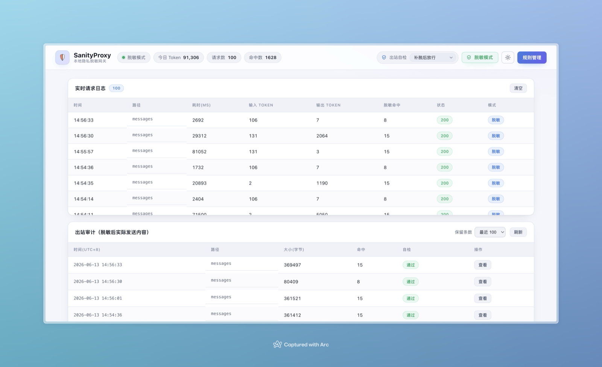

<!-- Language switch -->
[简体中文](README.md) · **English**

# SanityProxy

A local reverse proxy that desensitizes sensitive data before it reaches Claude or any Anthropic-compatible LLM API — and restores it in the response. Designed for legal documents, medical records, and any workflow where raw PII must never leave your machine.

```
Claude Code ──► SanityProxy (localhost:8080) ──► api.anthropic.com
                     │ desensitize / restore            │ sees only tags
                     └─── raw PII never leaves host ────┘
```

## How it works

1. Claude Code sends an API request containing sensitive text
2. SanityProxy intercepts it and replaces PII with `[[SANITY_CATEGORY_NNN]]` placeholders
3. The sanitized request is forwarded to the upstream LLM
4. The LLM responds using the same placeholders
5. SanityProxy restores all tags to original values before returning to Claude Code

Both `POST /v1/messages` (including streaming) and `POST /v1/messages/count_tokens` are sanitized — they carry the same conversation content, so token-counting requests can't leak raw PII either.

Claude Code receives a complete, natural response — with no awareness of the proxy.

### Safe with extended thinking

The model's own artifacts — `thinking` blocks and their cryptographic `signature` — round-trip **byte-for-byte** through the whole pipeline (desensitize / self-check / re-mask / restore). They are never rewritten, so upstream signature validation always passes. (`thinking` content is intentionally **not** tag-restored in responses, so it stays in tag-space across turns and signatures stay valid — you'll see tags in the reasoning panel, which is by design.) Streaming restoration is SSE-event-aware: it restores only the answer text and tool inputs, reassembles tags split across stream events, and records token usage.

## Built-in rules (legal document focus)

| Rule | Category | Example |
|------|----------|---------|
| National ID | Personal | `110101199001011234` |
| Passport | Personal | `E12345678` |
| Name | Personal | Names after 被告人 / 原告人 / 委托人 etc. |
| Mobile | Contact | `13812345678` (first 3 digits preserved) |
| Landline | Contact | `010-12345678` |
| Email | Contact | `user@example.com` |
| Bank card | Finance | 16–19 digit numbers |
| Business registration | Org | 18-char unified social credit code |
| Case number | Legal | `（2024）京民初第1234号` |
| License plate | Other | `京A12345` |

Custom rules can be added via the web dashboard or API.

## Quick start

**Requirements:** Python 3.9+

```bash
# 1. Install dependencies
cd proxy
pip install -r requirements.txt

# 2. Start the proxy
python main.py
# → http://127.0.0.1:8080

# 3. Open the dashboard
open http://localhost:8080/dashboard

# 4. Point Claude Code at the proxy
ANTHROPIC_BASE_URL=http://localhost:8080 claude
```

## What it looks like

On a successful start the terminal prints the listen address, dashboard URL, and current mode, followed by Uvicorn's startup log:

```text
SanityProxy starting on http://127.0.0.1:8080
Dashboard: http://127.0.0.1:8080/dashboard
Mode: desensitize
INFO:     Started server process [12345]
INFO:     Waiting for application startup.
INFO:     Application startup complete.
INFO:     Uvicorn running on http://127.0.0.1:8080 (Press CTRL+C to quit)
```

Open `http://localhost:8080/dashboard` for the live request log, outbound audit, rule manager, and rule tester (with one-click light/dark theme):

<p align="center">
  
</p>

## Verify it's working

```bash
cd proxy
python -m pytest tests/ -v
```

All tests must pass, covering four areas:
- **Outbound desensitization** — raw PII never reaches the LLM; system prompts and `count_tokens` are sanitized too
- **Inbound restoration** — tags are restored before reaching the caller; transparent (bypass) mode works
- **Fail-closed self-check** — `tool_result`/`tool_use` fields are masked; PII outside `messages` is backstopped; block/remask/off policies
- **Thinking signatures & streaming** — `thinking`/`signature` stay byte-identical; streaming restores text but not thinking, reassembles split tags, logs usage; non-200 upstream returns its real status

## Dashboard

The web dashboard at `http://localhost:8080/dashboard` provides:
- Real-time request log — fixed-height, scrollable panel with a sticky header and live row counter (token counts now populate for streaming requests)
- Outbound audit — snapshots of what was actually sent upstream (after masking); retain the last 20 / 100 / 200 / 500 / all
- Self-check policy switch — remask (default) / block (fail-closed) / off
- Smart name detection — toggle (on by default): a jieba word-segmentation pass that recalls bare names with no role-word cue (beyond the regex rules), at token granularity so words like 高强度 aren't broken; a probabilistic add-on, one click to turn off
- Upstream routing — route by the request `model` to different upstreams (Anthropic / DeepSeek / GLM…); add/disable upstreams and routes, pick the default upstream, and see whether each upstream's key is ready (shows ✓/✗ only, never the key); see *Multiple upstreams / third-party models*
- Rule manager — enable/disable rules, add custom patterns, import/export JSON
- Rule tester — paste text and preview desensitization output instantly
- Mode toggle — switch between desensitize and transparent mode
- Light/dark theme — one-click toggle in the header, remembers your choice

## Configuration

Edit `proxy/config.py`:

```python
UPSTREAM_URL = "https://api.anthropic.com"  # anthropic default base / single-upstream fallback
LISTEN_HOST  = "127.0.0.1"
LISTEN_PORT  = 8080
MODE         = "desensitize"                # or "transparent"

# Multi-upstream: built-in anthropic / deepseek / glm + routes (see below)
UPSTREAMS = [...]   # each: name / base_url / auth_scheme / token_env / supports_count_tokens
ROUTES    = [...]   # ordered; glob-match the model → target upstream (+ optional model_rewrite)
```

Upstreams/routes can also be edited live in the dashboard's *Upstream routing* panel (persisted to `sanity.db`); **API keys always come from environment variables and are never stored**.

## Multiple upstreams / third-party models (DeepSeek / GLM, etc.)

Claude Code honors a single `ANTHROPIC_BASE_URL`, so all requests go to SanityProxy, which then **routes** by the request body's `model` field to different upstreams. DeepSeek and GLM both expose **Anthropic-compatible endpoints**, so the desensitization logic is reused unchanged.

**Credentials come only from environment variables** — never written to `sanity.db` / logs / snapshots:

```bash
export DEEPSEEK_API_KEY=sk-...   # DeepSeek
export GLM_API_KEY=...           # Zhipu GLM (Z.AI / BigModel)
# Anthropic: no key needed when logged in via a Claude subscription (OAuth) — the proxy passes your existing auth through
```

Built-in upstreams and default routes (`proxy/config.py`, also editable in the dashboard):

| Upstream | base_url | Auth | Default route |
|----------|----------|------|---------------|
| anthropic | `https://api.anthropic.com` | x-api-key / pass-through | `claude*` |
| deepseek | `https://api.deepseek.com/anthropic` | `x-api-key` (`DEEPSEEK_API_KEY`) | `deepseek*` |
| glm | `https://api.z.ai/api/anthropic` (CN: `open.bigmodel.cn/api/anthropic`) | `Bearer` (`GLM_API_KEY`) | `glm*` |

To use a third-party model, just set the model name on the Claude Code side — the proxy routes on it:

```bash
ANTHROPIC_BASE_URL=http://localhost:8080 ANTHROPIC_MODEL=deepseek-v4-flash claude
```

Each route supports `model_rewrite` (rewrite `model` to the upstream's real name before forwarding). The live log and outbound audit gain an "upstream" column showing where each request went.

**Caveats**: DeepSeek/GLM don't document `count_tokens`, so the proxy returns a **local estimate** for upstreams that don't support it (avoids 404s); `thinking`/`signature` still round-trip byte-for-byte, but Anthropic's encrypted-signature semantics don't hold on third parties. OpenAI-format (non-Anthropic) upstreams need protocol translation and are out of scope here (chain a translator like claude-code-router / LiteLLM in front).

## Project structure

```
proxy/
├── main.py           # entry point
├── server.py         # FastAPI routes + proxy logic
├── desensitizer.py   # core desensitize / restore engine
├── routing.py        # multi-upstream model routing (pick upstream, inject auth)
├── rules.py          # built-in rule definitions
├── storage.py        # SQLite rules/upstreams/routes + in-memory log buffer (no secrets)
├── models.py         # Pydantic models
├── config.py         # configuration (incl. built-in UPSTREAMS / ROUTES)
├── static/           # web dashboard (HTML / JS / CSS, no build step)
└── tests/            # automated tests (outbound, inbound, fail-closed, thinking/streaming, routing)
```

## Managing your documents

When you place sensitive source files (legal docs, records, contracts) in the project for Claude Code to read, treat them as the data to be protected — **never commit them**. A `materials/` directory (plus `workspace/`, `data/`, `*.private/`) is pre-ignored in `.gitignore`:

```
sanity_claude/
├── proxy/          # the tool (tracked)
├── materials/      # raw sensitive source files (gitignored — never committed)
│   └── 2026-case-A/...
└── workspace/      # Claude's generated analysis/drafts (gitignored)
```

Reading a local file doesn't send it anywhere; content only leaves the machine when it's put into a request — and then **only in desensitize mode**, where the proxy swaps PII for tags (verify in the dashboard's Outbound audit). For identifiers beyond the built-in rules (employee IDs, internal ticket numbers), add a custom rule first. Keep your own encrypted backup of `materials/` — it's never in git. See AGENTS.md → "资料文件管理" for the full convention.

## Security notes

- The proxy binds to `127.0.0.1` by default — not exposed to the network
- `sanity.db` stores only rules, upstreams/routes and settings (**no original text and no API keys**); local-only and excluded from version control
- Each upstream's API key comes **only from environment variables** (the routing table records just the variable name); read at request time, kept in memory only, never written to the DB / logs / snapshots — the dashboard shows "key ready" status, not the key itself
- The tag↔value mapping is **per-request**: created fresh for each request and discarded when it finishes — raw PII is never retained process-wide or written to disk
- Response headers that describe the original bytes (`content-encoding` / `content-length` / `transfer-encoding`) are stripped, since the proxy decompresses and rewrites the body
- Your source documents live in gitignored directories (see *Managing your documents*) and are never committed
